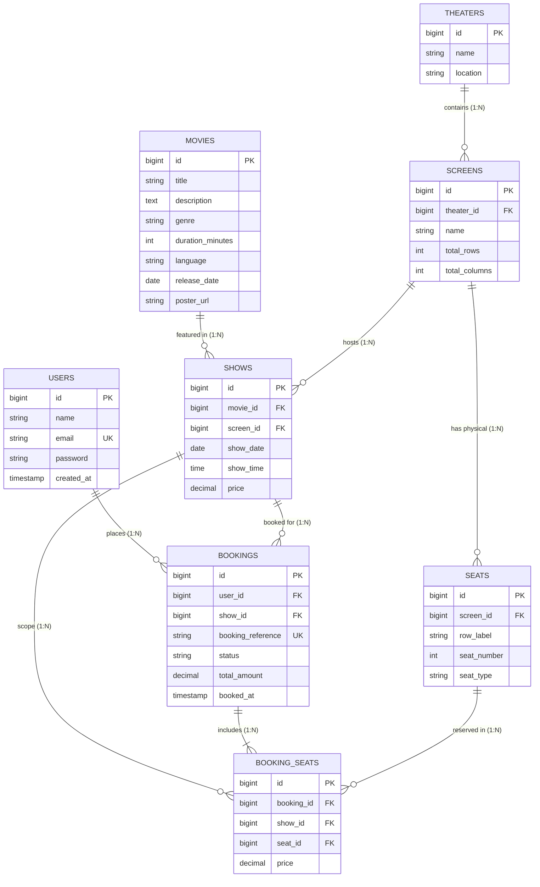

# CinéPulse Movie Ticket Booking System — Entity-Relationship (ER) Diagram

## 1. Overview
This document specifies the relational database schema for the CinéPulse Movie Ticket Booking System.

---

## 2. Mermaid ER Diagram

---

## 3. Entity & Cardinality Summary

| Entity | Primary Key | Foreign Keys | Key Relationships |
|--------|-------------|--------------|-------------------|
| `users` | `id` | None | $1:N$ to `bookings` |
| `movies` | `id` | None | $1:N$ to `shows` |
| `theaters` | `id` | None | $1:N$ to `screens` |
| `screens` | `id` | `theater_id` | $1:N$ to `seats`, $1:N$ to `shows` |
| `seats` | `id` | `screen_id` | Physical seat template per screen |
| `shows` | `id` | `movie_id`, `screen_id` | Links Movie + Screen + Showtime |
| `bookings` | `id` | `user_id`, `show_id` | $1:N$ to `booking_seats` |
| `booking_seats` | `id` | `booking_id`, `show_id`, `seat_id` | Junction table enforcing show-specific unique seat reservation |

> **Key Design Guarantee**: Physical seats belong to a `screen`. Availability depends on the `show`. Unique constraint `uk_show_seat_unique` on `(show_id, seat_id)` prevents double-booking across any booking for the same show.
